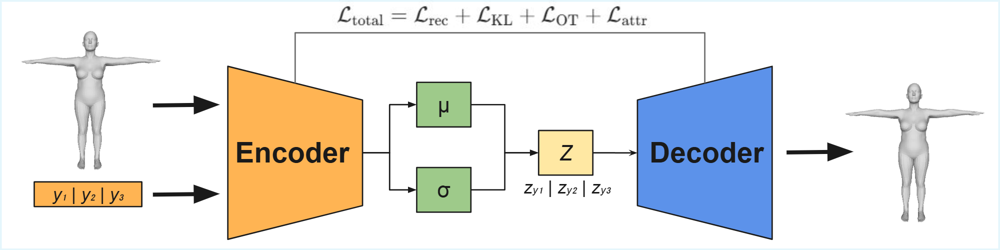
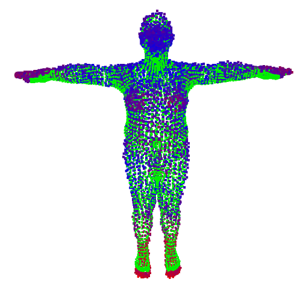
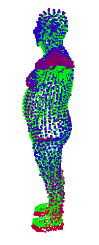
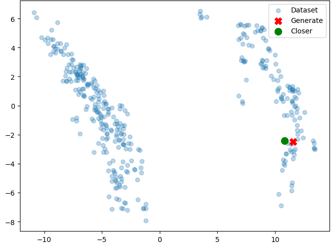

# Disentangled Latent Space for 3D Human Body Models with CVAE and OT
This repository contains the official implementation of the UCAMi 2025 paper **“Learning Disentangled Latent Space for 3D Human Body Models with Conditional Variational Autoencoders and Optimal Transport.”** We integrate a Conditional VAE with Optimal Transport regularization to impose geometric structure on the latent space learned from STAR-based body meshes. The model yields a smooth, compact, and disentangled representation conditioned on anthropometric variables (e.g., weight, height, sex), enabling high-fidelity reconstruction, controlled shape generation and smooth latent interpolations across multi-session scans collected during nutritional treatments.

[](https://opensource.org/licenses/MIT)
[](https://www.python.org/downloads/release/python-380/)
[](https://pytorch.org/)


## 👀 Overview



- **Encoder (graph-based):** Processes the 3D mesh and fuses an external conditioning vector (e.g., height, fat, gender) to output posterior Gaussian parameters.  
- **Partitioned latent space:** Latent vector *z* is split into three disjoint subspaces, nudging each partition to encode a specific attribute and promoting disentanglement.  
- **Decoder (MLP):** Reconstructs the mesh from [*z*||*y*] (latent + conditions).  
- **Loss:**  
  - Reconstruction (Chamfer Distance)  
  - Latent regularization (KL or MMD)  
  - Sinkhorn divergence (OT) for geometric consistency  
  - Attribute consistency (MSE/BCE)


## 🎯 Key Features
- **CVAE + OT:** Conditional VAE trained with OT.
- **Disentanglement:** Encourages factorized latent factors aligned with anthropometric attributes.
- **STAR compatibility:** Works with STAR parametric human body models.
- **Smooth interpolations:** OT regularization yields consistent latent traversals.
- **Reconstruction & generation:** Reconstruct meshes and sample new shapes under conditions (e.g., weight/height/gender).

## 🗂️ Repository Structure
```
.
├── README.md            # This file
├── LICENSE              # MIT License (or project-specific)
├── main.py              # Entry point / CLI for train, eval and inference
├── requirements.txt     # Requirements to create the enviroment
└── lib/
    ├── __init__.py      # Makes 'lib' a Python package
    ├── train.py         # Training loop and checkpointing
    ├── losses.py        # Loss functions
    ├── models.py        # Model definitions (Encoder/Decoder)
    ├── eval.py          # Metrics & reporting (reconstruction, OT, disentanglement)
    ├── utils.py         # Normalizations, Data loading, edge_index, etc.
    └── dataset.py       # Dataset loader
```


## 📈 Results (Global Reconstruction Metrics)
| Model       | Vertex Error ↓ | Chamfer Dist. ↓ | Wasserstein Dist. ↓ |
|-------------|----------------:|----------------:|--------------------:|
| CVAE        | 43.1            | 1.7             | 1.5                 |
| **CVAE + OT** | **25.9**        | **0.6**         | **0.5**             |
| CWAE        | 32.7            | 1.1             | 0.9                 |
| **CWAE + OT** | **21.2**        | **0.5**         | **0.3**             |

## 🔎 Visualization

|  |  |  |
|:---:|:---:|:---:|
|**Model — Front View**| **Model — Side View** | **Representations in Latent Space** |


## 🔗 Citation

If you use this code in your research, please cite:

## 📝 License

This project is licensed under the MIT License - see the [LICENSE](LICENSE.txt) file for details.

## 🤝 Acknowledgments

This work was funded by the Spanish State Research Agency (AEI) through grants **PID2023-149562OB-I00** and **PID2023-152804OB-I00**, awarded by **MCIN/AEI/10.13039/501100011033**, and financed by the Government of the Valencian Community (Generalitat Valenciana).

Project context: [Tech4Diet](https://github.com/Tech4DLab).

## 📬 Contact

| Name | Role | GitHub | Contact |
|------|------|--------|---------|
| [Mario Jerez Tallón](https://github.com/Mariojt72) | Author | @Mariojt72 | mario.jerez@ua.es |
| [Dr. Nahuel Emiliano Garcia d'Urso](https://github.com/nawue) | Co-authors | @nawue | nahuel.garcia@ua.es |
| [Ismael Beviá Ballesteros](https://github.com/ibevias) | Co-authors | @ibevias | ismael.bevias@ua.es |
| [Bernabé Sanchez Sos](https://github.com/Bernabe19) | Co-authors | @Bernabe19 | bernabe.sanchez@ua.es |
| Dr. Andrés Fuster Guilló | Co-authors | – | fuster@ua.es |
| Dr. Jorge Azorín López | Co-authors | – | jazorin@ua.es |
| Dr. Marcelo Saval Calvo | Co-authors | – | m.saval@gcloud.ua.es |
